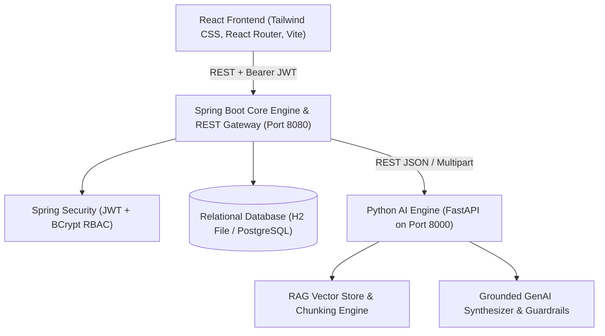
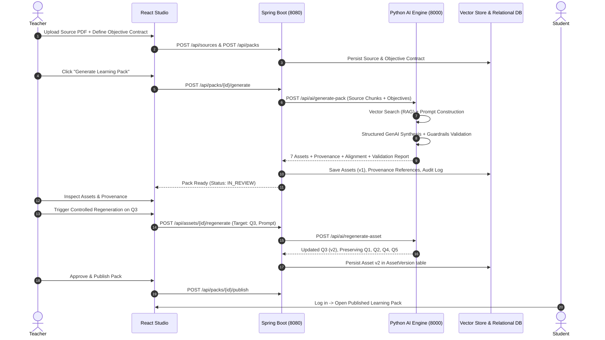

# LessonFoundry – Constraint-Aware Learning Asset Generation Studio

[](https://github.com/LessonFoundry)
[](https://github.com/LessonFoundry)
[](https://github.com/LessonFoundry)

> **Turn trusted teaching material into consistent, classroom-ready learning packs with grounded Generative AI.**

---

## 1. Executive Summary & Problem Statement

Educators spend excessive hours converting trusted educational sources (textbook chapters, lecture notes, syllabus guides) into cohesive classroom materials:
1. **Concept Explanations**
2. **Step-by-Step Worked Examples**
3. **Formative Quizzes**
4. **Master Answer Keys**
5. **Differentiated Practice (Guided & Advanced)**
6. **Exam Revision Cheat-Sheets**

Generic AI chatbots and simple PDF summations fail because they:
- Suffer from **hallucinations** and off-syllabus drift.
- Create **cross-asset contradictions** (e.g. Quiz questions that mismatch the Answer Key, or worked examples that contradict theory).
- Lack **pedagogical alignment matrices** and **source provenance traceability**.
- Force all-or-nothing regeneration rather than **controlled single-question regeneration** with immutable version history.

**LessonFoundry** solves this with a constraint-aware, grounded generative AI architecture enforcing strict source grounding, pedagogical contracts, automated consistency guardrails, teacher review workflows, and versioned asset storage.

---

## 2. System Architecture

LessonFoundry is built as a clean microservices architecture separating client interface, enterprise persistence/RBAC, and isolated AI RAG computation.



### End-to-End Generation & Review Workflow



---

## 3. Technology Stack

### Frontend
- **Framework**: React 18 / Vite
- **Styling**: Tailwind CSS, Glassmorphism design system
- **Routing**: React Router 6 with strict role protection (`ProtectedRoute`, `RoleRoute`)
- **HTTP Client**: Axios with JWT request & response interceptors
- **Icons**: Lucide React

### Backend Core
- **Framework**: Java 21, Spring Boot 3.2.4
- **Security**: Spring Security 6, Stateless JWT Authentication, BCrypt Password Encoders
- **Data Access**: Spring Data JPA, Hibernate ORM
- **Database**: H2 Database (zero-friction persistent file store `lessonfoundry_db`) / PostgreSQL Driver
- **PDF Extraction**: Apache PDFBox 3.0.2

### Python AI Microservice
- **Framework**: Python 3.10+, FastAPI, Uvicorn
- **Document Processing**: `pypdf`, Regex Semantic Chunker with Page Number tracking
- **Vector Retrieval**: In-Memory Vector Store with TF-IDF and Cosine Similarity
- **Guardrails**: Cross-Asset Consistency Verifier, Answer Matching, Contradiction Detection, Objective Alignment Matrix Calculator
- **LLM Engine**: Google Gemini / OpenAI integration with high-precision Grounded Synthesis engine

---

## 4. Role-Based Access Control (RBAC)

| Capability / Resource | ADMIN | TEACHER | STUDENT |
| :--- | :---: | :---: | :---: |
| **Public Landing & Login** | ✓ | ✓ | ✓ |
| **Upload Source Documents (PDF/TXT)** | ✓ | ✓ | ✗ |
| **Create Objective Contracts & Packs** | ✓ | ✓ | ✗ |
| **Trigger RAG & LLM Generation** | ✓ | ✓ | ✗ |
| **Controlled Single-Asset Regeneration** | ✓ | ✓ | ✗ |
| **Approve / Request Revisions on Assets** | ✓ | ✓ | ✗ |
| **Publish Learning Pack to Catalog** | ✓ | ✓ | ✗ |
| **Inspect Source Provenance & Chunks** | ✓ | ✓ | ✗ |
| **Inspect Asset Version History (v1, v2)** | ✓ | ✓ | ✗ |
| **Student Interactive Study Mode** | ✓ | ✓ | ✓ |
| **User Administration & Role Change** | ✓ | ✗ | ✗ |
| **Full Security Audit Trail** | ✓ | ✓ (Own) | ✗ |

---

## 5. Seed Demo Credentials

| Role | Email | Password | Access Dashboard |
| :--- | :--- | :--- | :--- |
| **Teacher** | `teacher@example.com` | `password123` | `/teacher/dashboard` |
| **Admin** | `admin@example.com` | `password123` | `/admin/dashboard` |
| **Student** | `student@example.com` | `password123` | `/student/dashboard` |

---

## 6. Step-by-Step Demonstration Walkthrough

1. **Launch the Application**: Run the launcher or start the services (see Section 7).
2. **Open the Landing Page** (`http://localhost:5173`):
   - Review the Problem, Pipeline, Feature cards, and Workflow.
3. **Sign In as Teacher**:
   - Click **Sign In** -> Click **Teacher** demo quick fill -> Sign In.
4. **Teacher Dashboard**:
   - View seeded source documents, learning packs, and real-time audit logs.
5. **Upload a New Educational Source**:
   - Navigate to **Sources** -> Click **Upload Source Document**.
   - Upload any educational PDF/TXT or use direct text input.
   - Inspect the extracted text preview and semantic chunk count on the Source Detail page.
6. **Generate a Learning Pack**:
   - Click **Create Learning Pack from this Source**.
   - Define the **Pedagogical Contract** (Topic, Grade, Difficulty, and Objectives: e.g. OBJ-1, OBJ-2, OBJ-3).
   - Configure question quantities (Quiz: 5, Easy Practice: 3, Advanced Practice: 3).
   - Click **Generate Grounded Learning Pack** and watch the real-time RAG processing steps.
7. **Inspect Generated Learning Assets**:
   - **Explanation**: Grounded introduction, structured sections with chunk citations, and governing rules.
   - **Worked Example**: Problem statement, thought process, and verification check.
   - **Formative Quiz**: Multiple choice questions with pedagogical rationale and objective targets.
   - **Answer Key**: 100% matched solutions and common student misconceptions.
   - **Practice**: Level 1 (Guided with hints) and Level 2 (Applied multi-step problems).
   - **Revision Sheet**: Exam cheat-sheet, common pitfalls, and formula sheet.
   - **Alignment Matrix**: Objective-by-objective coverage verification table (`Covered`, `Partial`, `None`).
   - **Quality Guardrails**: Automated checks for source grounding and cross-asset consistency.
   - **Provenance**: Traceability view mapping each claim to source, page, and chunk ID.
8. **Execute Controlled Single-Asset Regeneration**:
   - In the **Quiz** tab, click **Regenerate Q3**.
   - Enter revision guidance: *"Make question simpler for Grade 8 students and emphasize inverse operations."*
   - Watch **Q3** update from **v1 to v2** with the badge *"v2 (Regenerated)"*, while questions Q1, Q2, Q4, and Q5 remain completely untouched.
   - Click **History** on any asset to inspect past iterations and teacher notes.
9. **Approve & Publish**:
   - Click **Approve Asset** -> Click **Approve & Publish Pack**.
10. **Verify Student Mode**:
    - Click **Sign Out** -> Sign in as **Student** (`student@example.com` / `password123`).
    - Open the published pack in the **Student Hub**.
    - Attempt the interactive quiz with instant scoring and explanation feedback.
    - Confirm that internal AI prompts, draft versions, teacher notes, and admin routes are completely hidden.
11. **Verify Admin Hub & Audit Trail**:
    - Sign out and log in as **Admin** (`admin@example.com` / `password123`).
    - View global metrics, user management, and the complete immutable chronological audit trail.

---

## 7. How to Run Locally

### Prerequisites
- Portable Java 21 & Maven 3.9 (pre-configured in `/tools` or standard system Java 21)
- Python 3.10+
- Node.js 18+

### Option A: One-Click Launcher (PowerShell)
```powershell
powershell -ExecutionPolicy Bypass -File .\scripts\start_all.ps1
```

### Option B: Manual Service Startup

#### 1. Python AI Service (Port 8000)
```powershell
cd ai-service
python -m pip install -r requirements.txt
python main.py
```

#### 2. Spring Boot Core Backend (Port 8080)
```powershell
# In project root
powershell -ExecutionPolicy Bypass -File .\scripts\mvn_run.ps1 -f backend/pom.xml spring-boot:run
```

#### 3. React Frontend (Port 5173)
```powershell
cd frontend
npm install
npm run dev
```

---

## 8. REST API Documentation

### Authentication (`/api/auth`)
- `POST /api/auth/register`: Register user account.
- `POST /api/auth/login`: Authenticate and return JWT token + user profile.
- `POST /api/auth/logout`: Invalidate session and record audit action.
- `GET /api/auth/me`: Get current authenticated user profile.

### Educational Sources (`/api/sources`)
- `GET /api/sources`: List sources uploaded by user (or all for admin).
- `POST /api/sources`: Upload PDF/TXT, extract text, chunk and index vectors.
- `GET /api/sources/{id}`: Get source details and extracted text.
- `DELETE /api/sources/{id}`: Delete source.

### Learning Packs & Generation (`/api/packs`)
- `GET /api/packs`: List teacher packs.
- `POST /api/packs`: Define objective contract and create draft pack.
- `GET /api/packs/{id}`: Get full pack details (assets, alignment, validation, objectives).
- `POST /api/packs/{id}/generate`: Run RAG retrieval, GenAI synthesis, and guardrails.
- `POST /api/packs/{id}/publish`: Publish approved pack to student catalog.
- `GET /api/packs/student/published`: Public student catalog of verified packs.

### Learning Assets & Review Workflow (`/api/assets`)
- `GET /api/assets/{id}`: Get asset details.
- `POST /api/assets/{id}/regenerate`: Controlled single-asset regeneration (creates v2).
- `POST /api/assets/{id}/approve`: Mark asset as approved.
- `POST /api/assets/{id}/request-revision`: Flag asset as `NEEDS_REVISION` with reason.
- `GET /api/assets/{id}/versions`: Get immutable version history.
- `GET /api/assets/{id}/provenance`: Get source chunk citations.

### Validation & Alignment (`/api/validation`)
- `GET /api/validation/pack/{packId}`: Get guardrail report (Passed, Warnings, Errors).
- `GET /api/validation/alignment/{packId}`: Get objective coverage matrix.

### Administration & Audit (`/api/users` & `/api/audit`)
- `GET /api/users`: List all users (Admin only).
- `PATCH /api/users/{id}/role`: Change user role (Admin only).
- `PATCH /api/users/{id}/status`: Enable/disable user account (Admin only).
- `GET /api/users/stats`: User counts and role breakdown.
- `GET /api/audit`: View chronological security and activity logs.

---

## 9. Verification & Automated Testing

### Backend Spring Boot Tests:
```powershell
powershell -ExecutionPolicy Bypass -File .\scripts\mvn_run.ps1 -f backend/pom.xml test
```
*Result: 4/4 passing (Auth, Source creation, Pack creation, Asset approval, Versioning, Audit logs).*

### AI Service Tests:
```powershell
cd ai-service
python test_ai_service.py
```
*Result: All tests passing (Chunking, Vector retrieval, Guardrails, Single-question regeneration).*

### Frontend Production Build:
```powershell
cd frontend
npm run build
```
*Result: Vite production bundle built cleanly with 0 errors.*
